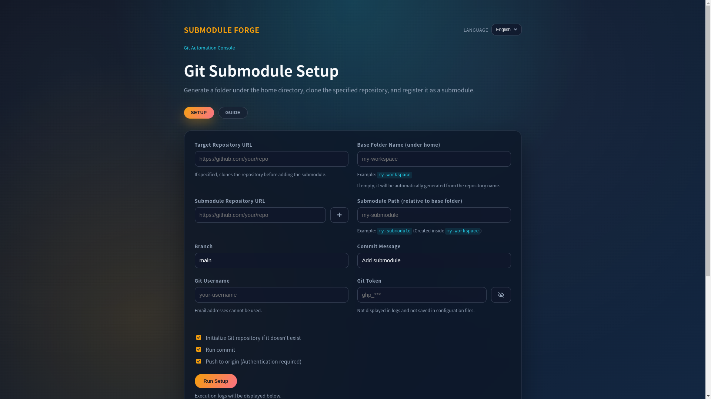

<p align="center">
---English---
</p>

<p align="center">

</p>

# Submodule Forge

Submodule Forge is a lightweight graphical tool that helps developers create and manage multiple Git submodules more easily.

## Features

- Create multiple Git submodules at once
- Manage Git submodules through a graphical interface
- Organize multiple repositories in one place
- Lightweight Electron desktop application
- Simple and easy setup

---

## Installation

Clone the repository:

```
git clone https://github.com/NEO1842/Submodule-Forge.git
```

Move into the repository folder:

```
cd Submodule-Forge
```

Move into the application folder:

```
cd "Submodule Forge"
```

Install dependencies:

```
npm install
```

Start the application:

```
npm start
```

## Usage

1. Launch **Submodule Forge**.
2. Select your main Git repository.
3. Add one or more Git submodules by entering their repository URLs.
4. Choose the folder where each submodule will be placed.
5. Click **Create Submodules** to generate them automatically.
6. Manage and organize your submodules from the graphical interface.

---

## Requirements

- Node.js
- npm
- Git

---

## Author

NEO1842

---

## License

MIT License

# Download the latest release from:

https://github.com/NEO1842/Submodule-Forge/releases

-----
<p align="center">
---日本語---
</p>

<p align="center">

</p>

# Submodule Forge

Submodule Forgeは、開発者が複数のGitサブモジュールをより簡単に作成および管理できるようにする、軽量なグラフィカルツールです。

## 特徴

* シンプルなインターフェースでGitサブモジュールを管理する
* 複数のリポジトリを1か所に整理する
* 軽量なElectronデスクトップアプリケーション
* 簡単なセットアップ

## インストール

リポジトリをクローンする:

```
git clone https://github.com/NEO1842/Submodule-Forge.git
```

リポジトリフォルダーに移動します。

```
cd Submodule-Forge
```

アプリケーションフォルダに移動します。

```
cd "Submodule Forge"
```

依存関係をインストールします:

```
npm install
```

アプリケーションを起動:

```
npm start
```
## 使い方

1. **Submodule Forge** を起動します。
2. メインの Git リポジトリを選択します。
3. 追加したい Git サブモジュールのリポジトリURLを入力します。
4. サブモジュールを配置するフォルダを選択します。
5. **Create Submodules** をクリックすると自動で作成されます。
6. GUIからサブモジュールを管理できます。

---

# 要件

- Node.js
- npm
- Git

---

#著者

NEO1842

## ライセンス

MITライセンス

# 最新のリリースを以下からダウンロードしてください:

https://github.com/NEO1842/Submodule-Forge/releases
